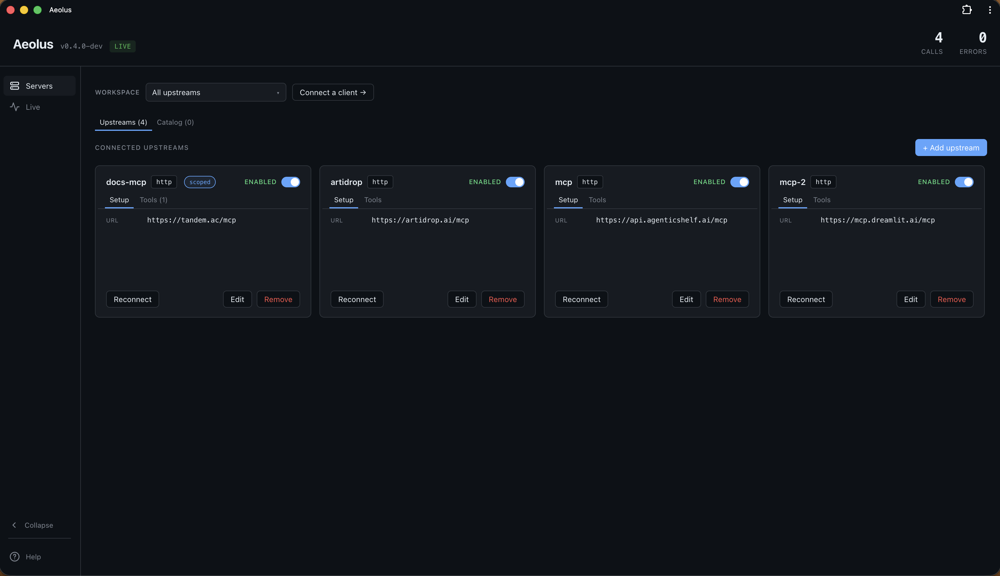

<p align="center">
  
</p>

<h1 align="center">Aeolus</h1>

<p align="center">
  <strong>A local daemon that gateways every MCP server you use through one dashboard.</strong>
</p>

<p align="center">
  <a href="https://github.com/aeolus-labs/aeolus/releases/latest"></a>
  <a href="https://github.com/aeolus-labs/aeolus/blob/main/LICENSE"></a>
  <a href="https://github.com/aeolus-labs/aeolus/actions/workflows/release.yml"></a>
  <a href="https://github.com/aeolus-labs/aeolus/stargazers"></a>
</p>

<p align="center">
  
</p>

Aeolus runs as a long-lived background service on your laptop. It exposes one MCP endpoint (Streamable HTTP + a stdio bridge) that aggregates every MCP server you've configured — filesystem, github, slack, postgres, hosted servers, anything that speaks MCP. Any client — Claude Code, Cursor, GitHub Copilot, Zed, Continue, custom agents — connects to that one endpoint instead of wiring up each MCP server individually. **Workspaces** let one daemon expose different tool sets per project, auto-detected by directory.

> Status: **v1.0.0 — first public release.** Stable YAML config and CLI; new features ship as v1.x. Single binary; service install on macOS (launchd) and Linux (systemd user unit). Windows binaries run fine in the foreground.

## Why

Plain MCP gives you tools but leaves four gaps:

1. **Tool bloat.** Loading every tool from every connected MCP server burns context tokens and degrades model performance.
2. **No audit trail.** When an agent calls a tool, nobody logs who, what, when, with what arguments.
3. **No central policy.** Every client maintains its own allow/deny list, so the same "don't expose write-to-prod tools" rule has to be repeated in each one — and stays out of sync the moment you forget.
4. **No scoping.** Pointing Claude / Cursor / Zed at the right tools per project means hand-editing each one's config in each repo.

Aeolus closes those gaps without changing how MCP servers or clients work.

## How it fits

Today, each MCP client talks to MCP servers directly:

```
Consumer  ─►  filesystem MCP
          ─►  github MCP
          ─►  postgres MCP
```

With Aeolus, the consumer talks to one endpoint and the Aeolus daemon fans out:

```
Consumer  ─►  Aeolus daemon  ─►  filesystem MCP   (stdio)
                             ─►  github MCP       (stdio)
                             ─►  postgres MCP     (stdio)
                             ─►  example.com/mcp  (http)
```

Aeolus handles:

- **Aggregation** — many MCP servers, one endpoint
- **Namespacing** — tool names prefixed by upstream (`filesystem.read_file`) so collisions don't happen
- **Workspaces** — group servers per project; auto-detected by directory so Claude/Cursor/Zed pick the right set without per-project config edits
- **Filtering** — allow/deny rules per tool, with globs
- **Secret management** — env values and HTTP headers can live in the OS keychain, never in YAML
- **Observability** — every tool call logged with arguments + response + client name + workspace; dashboard at `http://localhost:8765`
- **Hot reload** — edit `aeolus.yaml` or use the dashboard editor; changes apply without disconnecting any client

## Install

```bash
brew install aeolus-labs/tap/aeolus
```

Or build from source (requires Go 1.22+ and Node 18+):

```bash
git clone https://github.com/aeolus-labs/aeolus.git
cd aeolus
make build && sudo mv ./aeolus /usr/local/bin/
```

## First run

```bash
# Install the OS service and start it (macOS launchd / Linux systemd
# user unit). Also writes a starter ~/.config/aeolus/aeolus.yaml if
# one doesn't already exist.
aeolus service install

# Open the dashboard
aeolus open
```

The dashboard lives at `http://localhost:8765`. Use it to add your first MCP server (Servers tab → Catalog or `+ Add upstream`). Changes apply immediately — no daemon restart needed.

To check status:

```bash
aeolus service status   # running | loaded, not running | not loaded
aeolus service logs -f  # tail the daemon's stderr
```

To remove:

```bash
aeolus service uninstall
brew uninstall aeolus    # if installed via brew
```

On Linux the systemd unit runs in user scope (`systemctl --user`), so it
starts when you log in. To keep it running across logouts:

```bash
sudo loginctl enable-linger $USER
```

If you'd rather run the daemon in the foreground (no service):

```bash
aeolus  # reads ~/.config/aeolus/aeolus.yaml by default
```

## Pin the dashboard to your Dock (optional)

The dashboard ships as an installable Progressive Web App, so it gets its own Dock icon and Cmd-Tab entry instead of being just another browser tab.

- **Chrome / Edge / Brave / Arc** (macOS, Windows, Linux): click the install icon in the URL bar → "Install Aeolus".
- **Safari 17+** (macOS Sonoma and later): with the dashboard open, `File → Add to Dock…`.
- **Firefox**: no install path — bookmark `http://localhost:8765` instead.

## Connect your MCP client

The same snippet works for any MCP client that supports stdio (Claude Desktop, Claude Code, Cursor, GitHub Copilot, Zed, Continue, custom agents). The `aeolus mcp` subcommand is a stdio shim that forwards to the running daemon.

### Claude Desktop

`~/Library/Application Support/Claude/claude_desktop_config.json`:

```json
{
  "mcpServers": {
    "aeolus": {
      "command": "aeolus",
      "args": ["mcp"]
    }
  }
}
```

### Claude Code

```bash
claude mcp add aeolus aeolus -- mcp
```

### Cursor

`~/.cursor/mcp.json` (or `.cursor/mcp.json` in a project):

```json
{
  "mcpServers": {
    "aeolus": {
      "command": "aeolus",
      "args": ["mcp"]
    }
  }
}
```

### GitHub Copilot (VS Code)

`.vscode/mcp.json`:

```json
{
  "servers": {
    "aeolus": {
      "type": "stdio",
      "command": "aeolus",
      "args": ["mcp"]
    }
  }
}
```

### Zed

`~/.config/zed/settings.json`:

```json
{
  "context_servers": {
    "aeolus": {
      "command": {
        "path": "aeolus",
        "args": ["mcp"]
      }
    }
  }
}
```

### Continue.dev

`~/.continue/config.json`:

```json
{
  "experimental": {
    "modelContextProtocolServers": [
      {
        "transport": {
          "type": "stdio",
          "command": "aeolus",
          "args": ["mcp"]
        }
      }
    ]
  }
}
```

### Custom agent (Anthropic / OpenAI SDK / local model)

Two options:

**A. Spawn the stdio bridge** (same shape as the snippets above) — works with any MCP client SDK.

**B. Connect directly over HTTP** — Aeolus serves Streamable HTTP at `http://localhost:8765/mcp`:

```ts
import { StreamableHTTPClientTransport } from '@modelcontextprotocol/sdk/client/streamableHttp.js'
import { Client } from '@modelcontextprotocol/sdk/client/index.js'

const transport = new StreamableHTTPClientTransport(new URL('http://localhost:8765/mcp'))
const client = new Client({ name: 'my-agent', version: '0.1.0' })
await client.connect(transport)
```

## Configuration

`~/.config/aeolus/aeolus.yaml` describes the upstream servers, tool rules, logging, and dashboard settings.

```yaml
upstreams:
  - name: filesystem
    command: npx
    args: ["-y", "@modelcontextprotocol/server-filesystem", "/tmp"]

  - name: github
    command: npx
    args: ["-y", "@modelcontextprotocol/server-github"]
    env:
      - GITHUB_PERSONAL_ACCESS_TOKEN=keychain:github.GITHUB_PERSONAL_ACCESS_TOKEN

  - name: hosted
    transport: http
    url: https://mcp.example.com/mcp
    headers:
      Authorization: keychain:hosted.Authorization

tools:
  allow:
    - filesystem.read_*
    - github.list_*
    - hosted.*
  deny:
    - filesystem.read_media_*

log:
  level: info
  format: json

dashboard:
  enabled: true
  addr: "localhost:8765"
```

### Transports

- **stdio** (default) — Aeolus spawns the MCP server as a subprocess.
- **http** — Aeolus POSTs JSON-RPC to a Streamable HTTP endpoint per the MCP spec.

### Secrets in the keychain

Any value in `env:` or `headers:` can be `keychain:<name>`. Aeolus resolves it from the OS keychain (macOS Keychain, Windows Credential Manager, libsecret on Linux) at spawn time. The actual secret never lives in `aeolus.yaml`. The dashboard's 🔓 toggle stores values into the keychain on save.

### Hot reload

Edits to `aeolus.yaml` (by hand or through the dashboard) are picked up immediately. Connected clients get a `tools/list_changed` notification so they refresh. Invalid configs are logged and ignored — the previous good config keeps running.

## Workspaces (per-project tool sets)

A **workspace** is a named subset of your upstreams. When an MCP client connects to Aeolus, the daemon resolves a workspace and exposes only that subset of tools.

Resolution priority:

1. Explicit `--workspace <name>` arg on `aeolus mcp`.
2. Auto-match: the bridge's current working directory and the MCP
   client's identity are matched against each workspace's `cwd_match`
   and `client_match` rules. If a workspace defines both, both must
   match (AND). The most specific matching workspace wins.
3. A workspace literally named `default` (if defined) — used as the global fallback.
4. Otherwise: only upstreams **not** in any workspace are exposed. (Scoped servers are exclusive to their scope.)

### Example

```yaml
upstreams:
  - { name: filesystem, command: npx, args: [...] }
  - { name: github,     command: npx, args: [...] }
  - { name: acme-db,    command: node, args: [./acme-db-server.js] }
  - { name: research-arxiv, transport: http, url: https://arxiv-mcp.example.com/mcp }

workspaces:
  - name: acme-backend
    include: [filesystem, github, acme-db]
    cwd_match: ["~/code/acme-backend/**"]

  - name: research
    include: [filesystem, research-arxiv]
    cwd_match: ["~/research/**"]
```

With this config:

- Claude running in `~/code/acme-backend/services/api` → sees `filesystem.*`, `github.*`, `acme-db.*`.
- Claude running in `~/research/papers` → sees `filesystem.*`, `research-arxiv.*`. Never sees `github` or `acme-db`.
- Claude running anywhere else → sees nothing (since every upstream is scoped). Add a `default` workspace or leave one upstream unscoped if you want a global fallback.

`cwd_match` patterns support:
- `~/path` — `~` expansion to your home dir
- exact path
- trailing `/**` for "this directory or any descendant"

Longest match wins so a more specific workspace outranks a broader one.

### Filter by client too

`client_match` lets a workspace only auto-select for specific MCP
clients. It's a list of case-insensitive substrings matched against the
client's identity string (e.g. `"Claude Code 1.2.3"`, `"cursor 0.4"`,
`"Visual Studio Code 1.95"`, `"Zed 0.1"`):

```yaml
workspaces:
  - name: claude-only-prod
    include: [acme-db]
    client_match: ["claude"]   # matches "Claude Code 1.2", "Claude Desktop"

  - name: cursor-research
    include: [filesystem, research-arxiv]
    cwd_match: ["~/research/**"]
    client_match: ["cursor"]   # AND with cwd_match — both must match
```

This is useful for "give Claude Code access to the prod DB but never
Cursor" or "this folder only opens its tools to a specific client".

### Per-project explicit

If your client doesn't run from a stable cwd (e.g., Claude Desktop's `.app` launched from the dock), use an explicit `--workspace`:

```json
// <project>/.claude/settings.local.json
{ "mcpServers": { "aeolus": { "command": "aeolus", "args": ["mcp", "--workspace", "acme-backend"] } } }
```

The dashboard's "Connect a client" button generates this snippet for you.

## The dashboard

Visit `http://localhost:8765` (or run `aeolus open`).

- **Guided tour** — auto-opens on first visit. Re-open anytime via the `Help` button at the bottom of the left sidebar.
- **Servers tab**: every configured upstream with per-card Enable/Disable, Reconnect, and Setup / Tools / Description sub-tabs. The Description tab carries the catalog blurb plus a copy-pasteable YAML snippet (secrets render as `keychain:` placeholders so the snippet is safe to share). Workspace dropdown at the top to switch between scoped views; the active workspace shows its cwd-match patterns inline. `Connect a client →` generates the exact JSON snippet for Claude / Cursor / VS Code Copilot / Zed.
- **Broken upstreams** get a red `broken` pill, an actionable error title (e.g., *"The URL is invalid — needs http:// or https:// prefix"* instead of the raw Go error), and the **last lines of the server's stderr** inline — so "process exited" comes with the actual reason (missing env var, runtime panic, etc.) right next to it.
- **Catalog tab**: browse ~2,600 MCP servers from the official MCP Registry. Filter by transport / auth, infinite scroll, one-click Add.
- **Live tab**: streaming tool calls — time, upstream, tool, client, latency, status. Click a row to expand syntax-highlighted JSON arguments and response, with a Copy button on each. Calls are tagged by workspace so you can see per-project usage.
- **Auto-refresh on hand-edits**: a long-lived SSE channel notifies the dashboard whenever the file watcher reloads `aeolus.yaml`, so changes you make in a text editor show up without pressing reload.

## CLI reference

```
aeolus                                 run as a daemon (foreground)
aeolus --config <path>                 daemon, custom config path
aeolus --dashboard-port <n>            daemon, override dashboard port

aeolus service install [--force]       write the OS service unit and
[--no-start]                           start the daemon. Also creates a
                                       starter ~/.config/aeolus/aeolus.yaml
                                       on first run.
                                       (macOS: launchd plist;
                                        Linux: systemd user unit)
aeolus service start                   start the daemon under your user
aeolus service stop                    stop the daemon
aeolus service status                  running / loaded, not running / not loaded
aeolus service restart                 in-place restart
aeolus service uninstall               stop + remove the service unit
aeolus service logs [-f] [-n N]        tail daemon stderr
                                       (macOS: ~/Library/Logs/aeolus/;
                                        Linux: journalctl --user)

aeolus mcp [--workspace <name>] [--daemon <url>] [--timeout <d>]
                                       stdio bridge to a running daemon
                                       (called by MCP clients — Claude / Cursor / etc.)

aeolus open                            open dashboard in default browser
aeolus init [--path <p>] [--force]     write a starter aeolus.yaml
aeolus --version                       print version
aeolus --help                          full help
```

## Repo layout

```
aeolus/
├── cmd/aeolus/             Go entry point (daemon, mcp bridge, service, open, init)
├── internal/
│   ├── mcp/                JSON-RPC + MCP types
│   ├── config/             YAML loader + validation
│   ├── upstream/           stdio + http upstream server impls
│   ├── proxy/              Engine (long-lived state), Proxy (stdio adapter)
│   ├── secrets/            OS keychain wrapper
│   ├── watcher/            aeolus.yaml file watcher
│   └── dashboard/          HTTP + SSE; embedded React build; /mcp endpoint
├── dashboard/              React source (Vite + TypeScript)
├── examples/               sample configs
└── Makefile                build orchestration
```

## Persisted state

| File | Owner | Contents |
|---|---|---|
| `~/.config/aeolus/aeolus.yaml` (or `$XDG_CONFIG_HOME/aeolus/aeolus.yaml`) | you | Upstreams, workspaces, tool rules, log/dashboard settings. Hand-editable. |
| `~/.local/share/aeolus/events.jsonl` (or `$XDG_DATA_HOME/aeolus/events.jsonl`) | daemon | Tool-call audit log. Append-only with automatic compaction; the dashboard reads its tail on start. |
| `~/.local/share/aeolus/dashboard_state.json` | daemon | UI preferences (tour dismissed, sidebar collapsed). Survives browser switches. |
| `~/Library/LaunchAgents/com.aeolus-labs.aeolus.plist` (macOS) | `aeolus service` | launchd unit. PATH inherited from your interactive shell at install time. |
| `~/Library/Logs/aeolus/aeolus.log` (macOS) | launchd | Daemon stderr. |
| `~/.config/systemd/user/aeolus.service` (Linux) | `aeolus service` | systemd user unit. PATH inherited from your shell. Logs go to the systemd journal (`journalctl --user -u aeolus`). |

OS keychain: any value in `env:` or `headers:` that starts with `keychain:` is resolved at spawn time. Secrets never live in YAML.

## License

MIT — see [LICENSE](./LICENSE).
